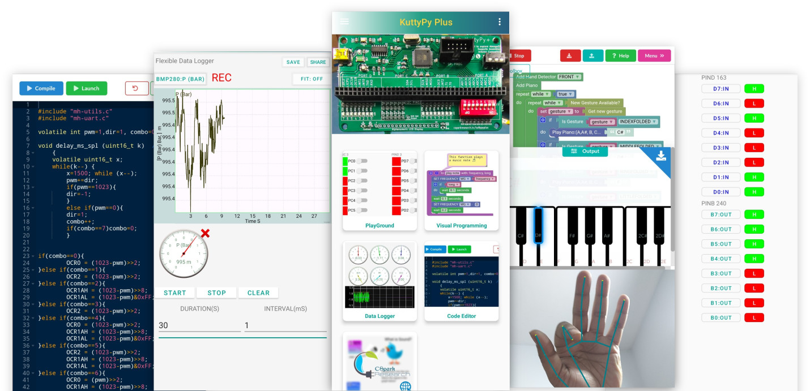
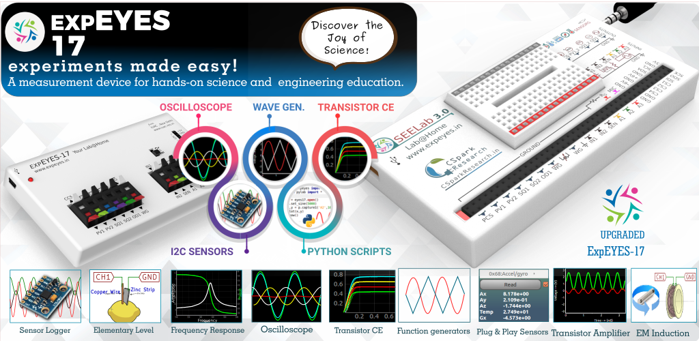

# Development Boards/Kits

* [https://shop.pcbcupid.com/](https://shop.pcbcupid.com/) makes and sells ESP32-based dev boards.
* [https://csparkresearch.in/kuttypyplus](https://csparkresearch.in/kuttypyplus) is an ATMEGA32 trainer which can be used for data collection/device control via a Python/Android interface which have real-time access to HW registers.
* [https://csparkresearch.in/seelab3](https://csparkresearch.in/seelab3) is a multi purpose data acquisition tool for learning electronics and performing science experiments.

## KuttypyPlus

Software - Real World bridge for learning embedded systems. The kuttyPy (/kʊtipʌɪ/) Microcontroller training software allows live manipulation of the registers in the ATMEGA32 on the KuttyPy board via a connected computer through a Python library or Graphical interface. The software has a built in IDE, A visual coding interface, and even AI tools for gesture recognition. It has live debugging and monitoring tools, and combined with the connected phone/laptop's visualization and analytical utilities, this approach has immense pedagogical potential for beginners to the microcontroller world.

The Python library, GUI, firmware, and KiCAD schematics are open source.

* Website : [https://csparkresearch.in/kuttypyplus]
* [Documentation RTD](https://kuttypy.readthedocs.io/en/latest/)
* [Python App, Firmware](https://github.com/csparkresearch/KuttyPy-GUI) 
* [Kicad schematics](https://github.com/expeyes/expeyes-programs/tree/master/kuttyPy)
* [Android App](https://play.google.com/store/apps/details?id=com.cspark.kuttypy)
 

## ExpEYES-17

A tool for learning science by exploring and experimenting. Integrates a host of test and measurement instruments into a small USB interfaced package.
Comes with open source python library , GUI, KiCAD schematics, and Firmware

* [website ](https://expeyes.in) expeyes.in
* [github link:](https://github.com/expeyes/expeyes-programs)  source code, firmware, schematics
* [Python library docs](https://eyes17lib.readthedocs.io/en/latest/)
* [Android app. ](https://play.google.com/store/apps/details?id=com.cspark.research.eyes17) Ad-Free, source not available yet
* Next Version , [SEElab3](https://github.com/expeyes/expeyes-programs)
* [Blog posts](https://csparkresearch.in/expeyes17/blog)

### Features:

* A Powerful tool for learning science by exploring and experimenting.
* 4 channel Oscilloscope[2x +/-16V programmable input, +/-3V input, Microphone. 2MSPS]
* Sine/Triangular Wave Generator, 5Hz to 5kHz. Programmable voltage sources, +/5V and +/-3.3V
* Supports Add-On I2C/SPI sensors for pressure, humidity, temperature, angular velocity, luminosity, magnetism...
* Frequency Counter and time measurements. RC Meter.
* Square Wave Generator 0.02Hz to 1MHz. 32Mhz Reference Out.
* 12-bit analog resolution. Fully calibrated
* 100+ documented experiments and easy to add more.

Supported on PC/Linux/Android. Programmable in Python/Javascript/Blockly
